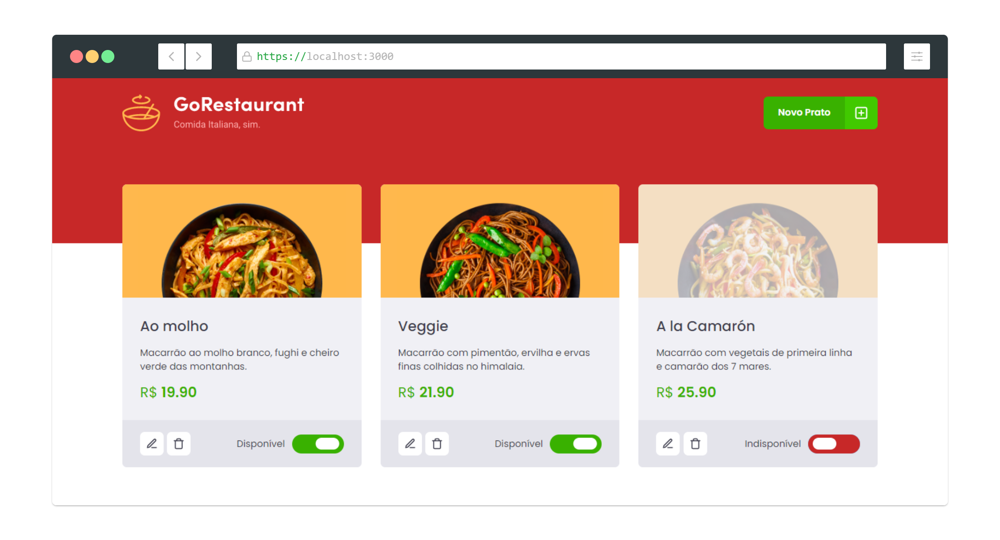
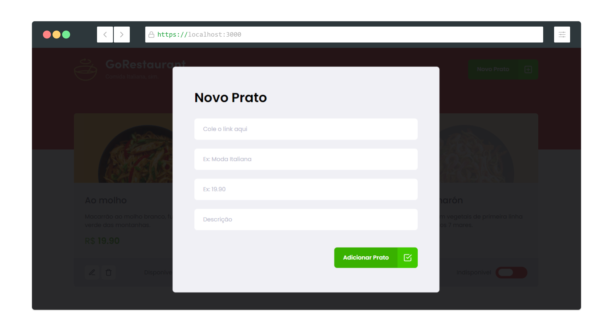
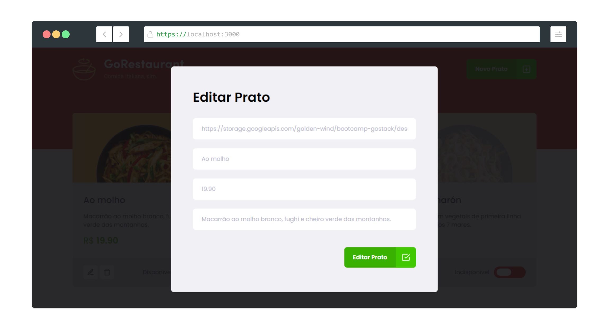

<h1 align="center">
    
</h1>

<h4 align="center">
  Go Restaurant
</h4>

  <a href="#metro-tecnologias">Tecnologias</a>&nbsp;&nbsp;&nbsp;|&nbsp;&nbsp;&nbsp;
  <a href="#fire-dependências">Dependências</a>&nbsp;&nbsp;&nbsp;|&nbsp;&nbsp;&nbsp;
  <a href="#key-como-inicializar">Como inicializar?</a>&nbsp;&nbsp;&nbsp;&nbsp;&nbsp;&nbsp;

 

  

  

  

## :metro: Tecnologias

Esse projeto foi desenvolvido com as seguintes tecnologias:

- [React](https://reactjs.org)
- [Typescript](https://www.typescriptlang.org/)
- [Json Server](https://github.com/typicode/json-server)

## :fire: Dependências

Para instalar as dependências de pacotes basta:

- npm install ou yarn

## :key: Como inicializar?

Para inicilizar em ambiente local deve-se seguir os passos abaixo:

- npm run json-server server.json -p 3333 ou yarn json-server server.json -p 3333
- npm run start ou yarn start para inicializar
